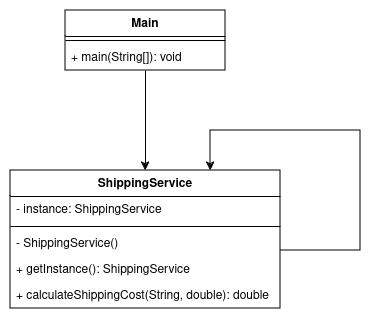
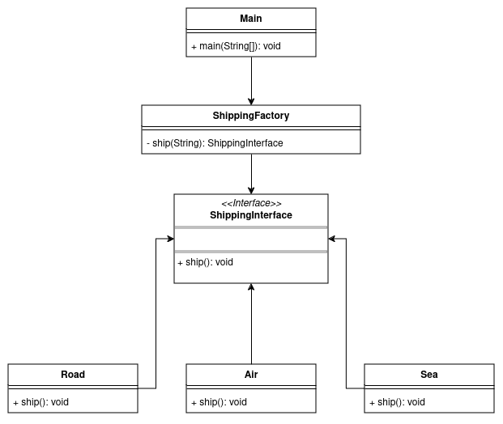
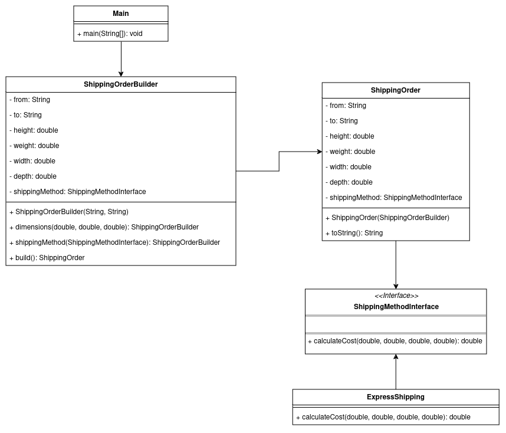
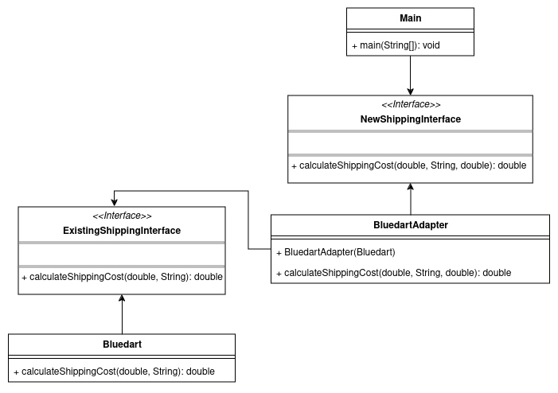
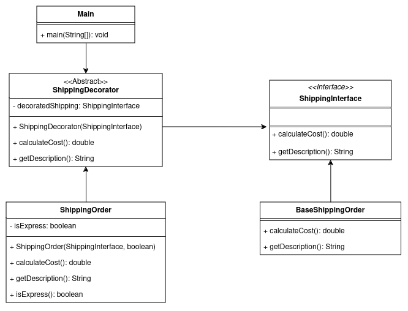
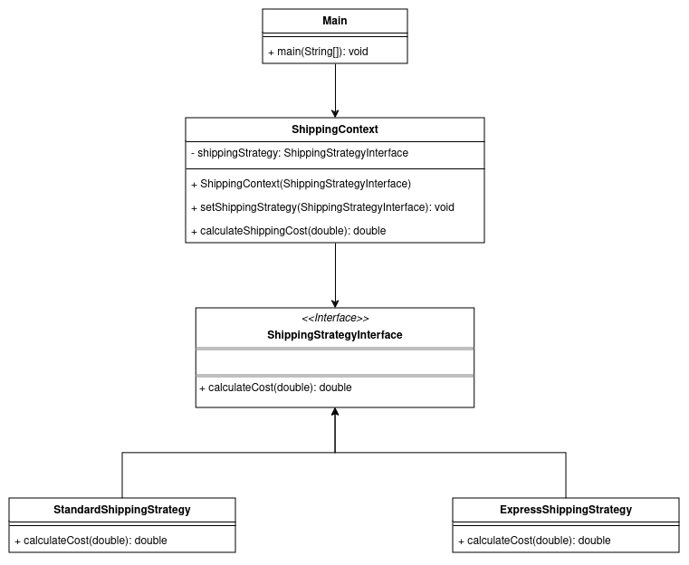
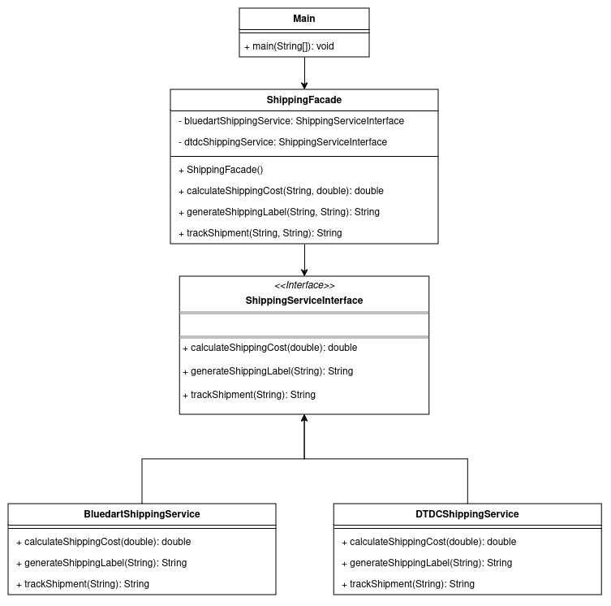
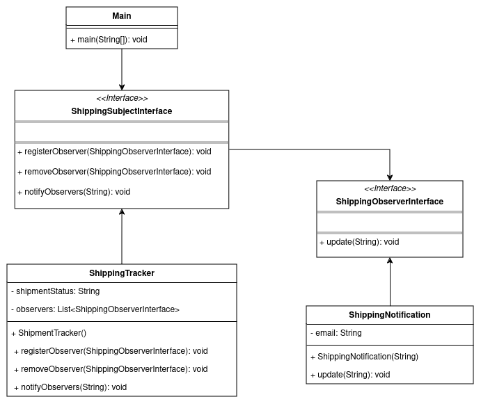
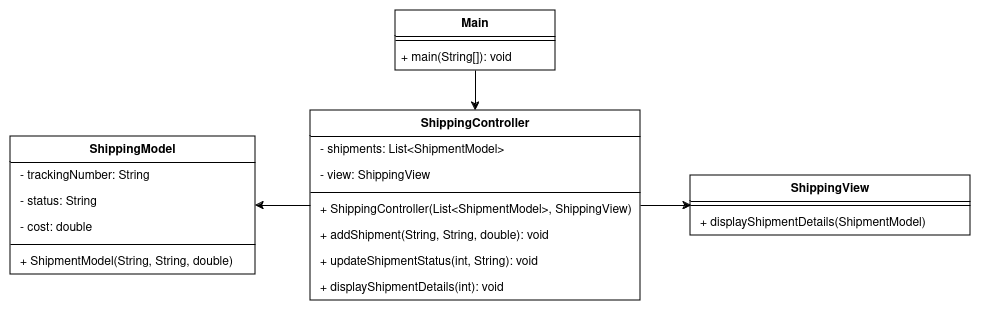

# design-patterns

This project demonstrates some of the commonly used design patterns.

1. **Singleton Pattern**:

   Singleton pattern ensures that a class has only one instance and provides a global point of access to it.

   

2. **Factory Pattern**:

   Factory Pattern provides an interface or abstract class for creating objects, but the specific type of object creation is delegated to concrete factory classes.

   

3. **Builder Pattern**:

   Builder Pattern helps in creating complex objects in a step-by-step manner, making the construction process more flexible and maintainable.

   

4. **Adapter Pattern**:

   Adapter Pattern helps in achieving interoperability between classes with incompatible interfaces, allowing them to work together seamlessly. 

   

5. **Decorator Pattern**:

   Decorator Pattern allows you to add new features or behavior to an object without modifying its underlying code.

   

6. **Strategy Pattern**:

    Strategy Pattern is like having multiple strategies to solve a problem, and you can choose which strategy to use based on the situation.

    

7. **Facade Pattern**:

   Facade pattern provides a unified interface to a set of interfaces in a subsystem. It defines a higher-level interface that makes the subsystem easier to use.

   

8. **Observer Pattern**:

   Observer pattern defines a one-to-many dependency between objects so that when one object changes state, all its dependents are notified and updated automatically.

   

9. **Model-View-Controller (MVC) Pattern**:

   MVC pattern separates an application into three main components: Model (data and business logic), View (presentation layer), and Controller (handles user input and updates the Model and View).

   
   
   